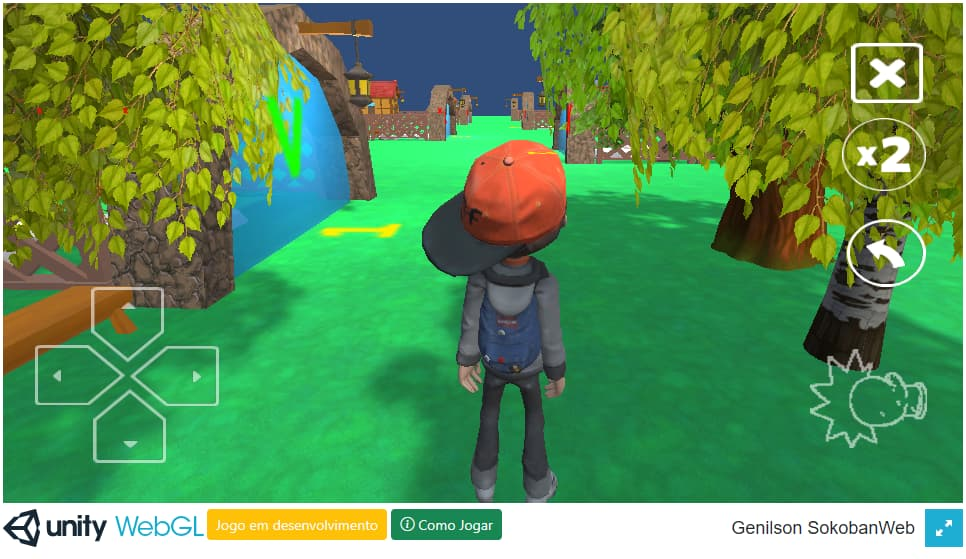
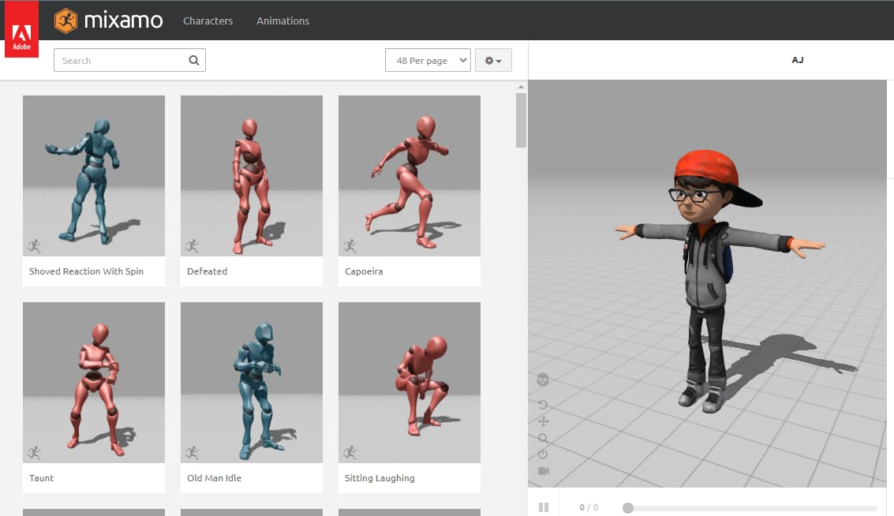

# SokoWeb



O Sokoweb é um jogo de transporte e movimentação de caixas em uma ária. 
O objetivo é empurrar as caixas em determinadas posições marcadas na fase.
Ao colocar cada caixa nas posições marcads, o jogador passa para a roxima fase.

- **[Jogar online](https://genilsonweb.com/sokoweb/)**

## Arquitetura

O game foi desenvolvido com a Engine de Jogos, Unity, e exportado para WebGL, com a finalidade de rodar em navegadores, inclusive, de telefones.

*A Unity deixou de dar suporte a linguagem de programação JavaScript em 2017.Por conta disso, todos os scripts de comando do jogo foram escritos em C#.*

*O personagem do jogo foi adquerido gratuitamente no site da Mixamo, sendo um asset que pode ser incorporado com diversos tipos de movimentos, tambem fornecidos pela Mixamo.*

*O personagem, assim como todos os assets utilizados no jogo (arvores, gramas, personagem, construções), poderiam (e seriam) feitos manualmente através da ferramenta Blender*. Porém, devido a ausencia de tempo para estudar a ferramenta de modelagem, foi escolhido adquerir os assets já prontos, pelo gerenciador de pacotes da própria Unity.*

**Blender é um programa de computador de código aberto, desenvolvido pela Blender Foundation, para modelagem, animação, texturização, composição e renderização de objetos.*

## Features

**Unity**

*Unity, é um motor de jogo proprietário, criado pela Unity Technologies.
Utiliza um editor visual e programação através de scripting, oferecendo aos utilizadores ferramentas profissionais, capazes de preencher os requisitos de qualquer tipo de jogo.*

*Uma característica muito interessante da Unity é que lhe permite fazer a build do game para diversas plataformas, como Android, Navegador (WebGL), IOS, Windows, Linux, Mac, PS5 e Xbox*

**C#**

*C Sharp (C#), é uma linguagem de programação, multiparadigma, de tipagem forte, desenvolvida pela Microsoft como parte da plataforma .NET. A sua sintaxe orientada a objetos foi baseada no C++ mas inclui muitas influências de outras linguagens de programação, como Object Pascal e, principalmente, Java.*

*Exemplo:*
``` 
using UnityEngine.SceneManagement;

public class load : MonoBehaviour
{
    public void LoadGame(string sceneName)
    {
        SceneManager.LoadScene(sceneName);
    }
}
```
*O código acima mostra a criação de uma função que carrega uma determinada cena do jogo que é passada por parametro quando a função é chamada. Essa função foi utilizada no botão de Play do game e chama a segunda cena do jogo (a primeira é a cena do menu).*

**Mixamo**

*Mixamo é uma empresa de tecnologia de computação gráfica 3D. Com sede em San Francisco. A empresa desenvolve e vende serviços baseados na web para animação de personagens em 3D, pertencente à Adobe Inc.*

*O Mixamo está disponível gratuitamente e não requer compras ou assinaturas adicionais.*



**WebGL**

*API em JavaScript, disponível a partir do novo elemento canvas do HTML5, 
que oferece suporte para renderização de gráficos 2D e 3D.*

## Como Jogar

*O video abaixo mostra como passar da primeira fase do jogo.*

*No teclado são utilizadas as teclas **W S A D** para movimentar o personagem. Enquanto que no celular é utilizado o controle virtual na tela do jogo.*

https://user-images.githubusercontent.com/53799004/227799681-a4d92e82-a4e8-411d-b03f-ab930d3cf57e.mp4


